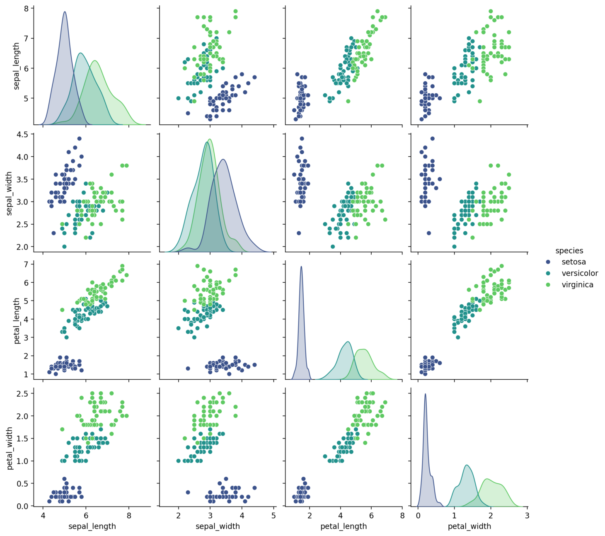
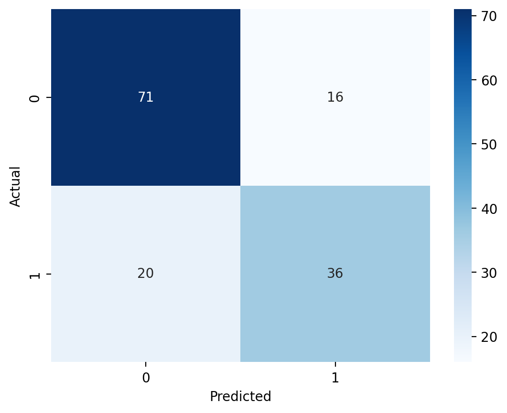
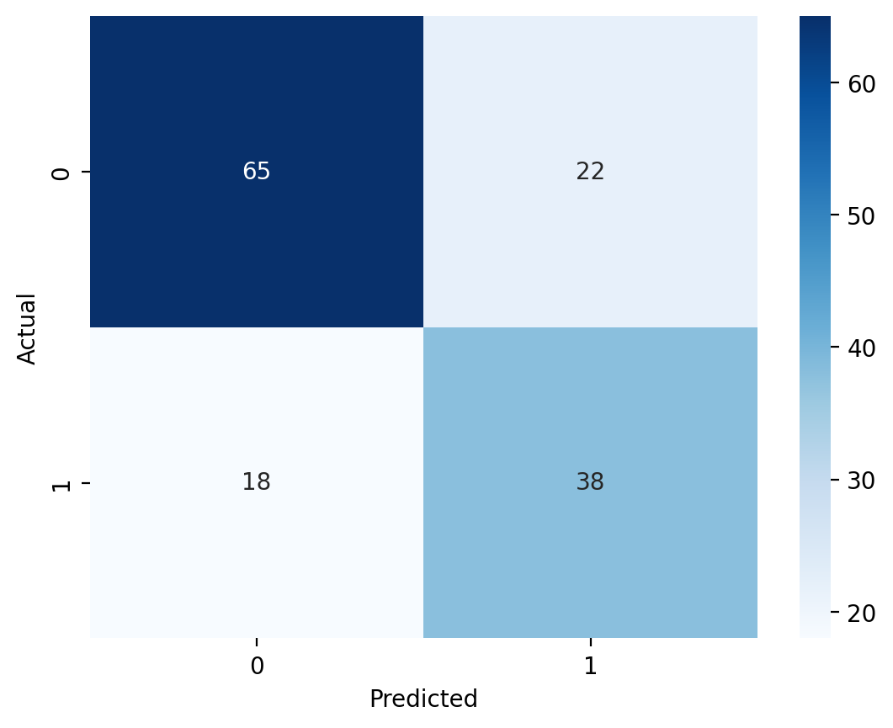

#  ⚙️ Streamlit Cloud Machine Learning App

## Project Overview:

Describe the goal of your project and summarize what the user can do with your app.

This interactive Streamlit application allows users to explore supervised machine learning models with built-in or custom datasets. Users can:

- Upload their own CSV data or use provided Titanic/Iris datasets

- Select features and target variables

- hoose between Logistic Regression, Decision Trees, or K-Nearest Neighbors models

- View performance metrics and visualizations

### Run Locally
In the requirements.txt terminal, run: 
pip install pipreqs

### Deployed Version Link
[Launch the App Here](https://kunisaki-data-science-portfolio.streamlit.app/)

### Necessary Libraries
- matplotlib 3.10.1
- pandas 2.2.3
- seaborn 0.13.2
- streamlit 1.37.1
- scikit-learn 1.5.1

## App Features:

- **Dataset Options**:
  - Built-in datasets: Titanic and Iris
  - Upload your own CSV file

- **Model Options**:
  - Logistic Regression
  - Decision Tree
  - K-Nearest Neighbors (KNN)

- **Interactive Hyperparameter Tuning**:
  - KNN: Adjust the number of neighbors (`k`)
  - Decision Tree: Adjust max depth and minimum samples to split

- **Performance Metrics**:
  - Accuracy, Precision, Recall, F1 Score
  - ROC AUC Score 
  - Confusion Matrix
  - Classification Report Table

- **Visualizations**:
  - Iris Dataset Pairplot
  - Confusion Matrix Heatmap
  - Feature Coefficients for Logistic Regression

## References:

To see some of the resources I used, and for further reading, please reference the sources below.

- **[Streamlit Sidebar](https://docs.streamlit.io/develop/api-reference/layout/st.sidebar)**
- **[Streamlit Tabs](https://docs.streamlit.io/develop/api-reference/layout/st.tabs)**
- **[Pandas 'select_dtypes'](https://pandas.pydata.org/docs/reference/api/pandas.DataFrame.select_dtypes.html)**
- **[Seaborn Pairplot](https://seaborn.pydata.org/generated/seaborn.pairplot.html)**
- **[Resize Image](https://stackoverflow.com/questions/14675913/changing-image-size-in-markdown)**

## Visual Examples:

### **1. Example Pairplot: Iris Data**

### **2. Confusion Matrix: Logistic Regression**

### **3. Confusion Matrix: Decision Tree**

### **4. Confusion Matrix: K-Nearest Neighbors**

