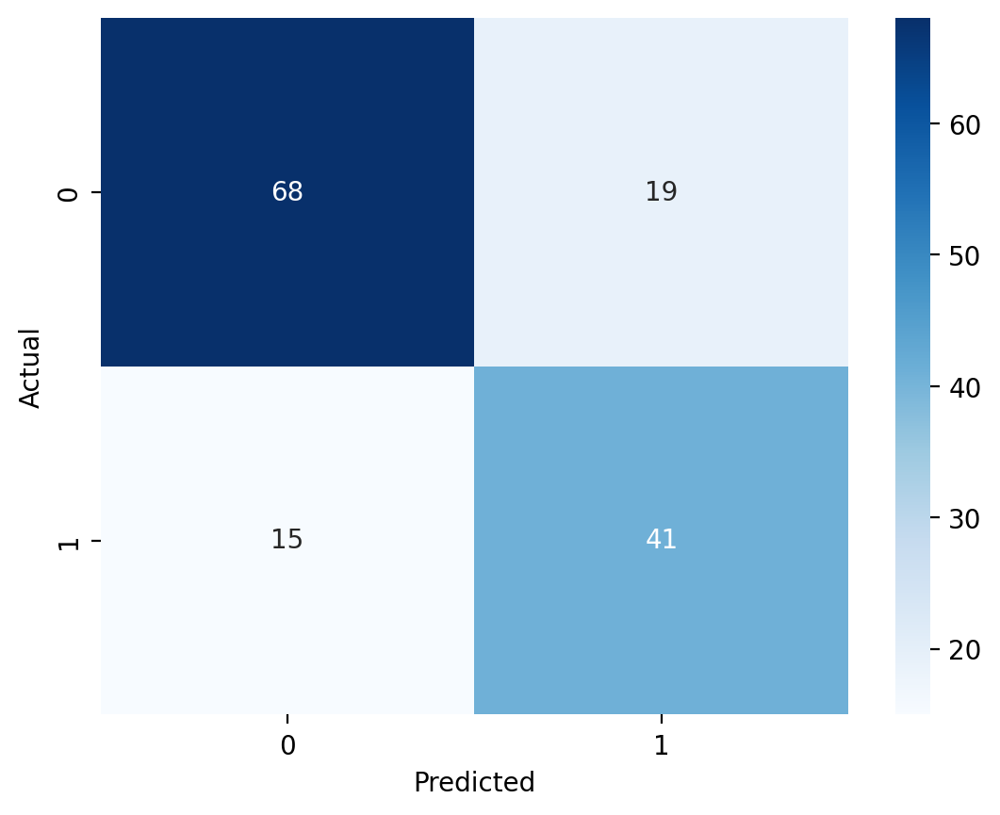

#  ⚙️ Streamlit Cloud Machine Learning App

## Project Overview:

Welcome! This interactive Streamlit application allows users to explore supervised machine learning models with built-in or custom datasets. Users can:

- Upload their own CSV data or use provided Titanic/Iris datasets

- Select features and target variables

- Choose between Logistic Regression, Decision Trees, or K-Nearest Neighbors ML models

- View performance metrics and visualizations

### Run Locally

cd MLStreamlitApp

Create a requirements.txt file

Run pip install pipreqs 

### Deployed Version Link
[Launch the App Here](https://kunisaki-data-science-portfolio.streamlit.app/)

### Necessary Libraries
- matplotlib 3.10.1
- pandas 2.2.3
- seaborn 0.13.2
- streamlit 1.37.1
- scikit-learn 1.5.1

## App Features:

- **Dataset Options**:
  - Built-in datasets: Titanic and Iris
  - Upload your own CSV file

- **Model Options**:
  - Logistic Regression
  - Decision Tree
  - K-Nearest Neighbors (KNN)

- **Interactive Hyperparameter Tuning**:
  - KNN: Adjust the number of neighbors (`k`)
  - Decision Tree: Adjust max depth and minimum samples to split

- **Performance Metrics**:
  - Accuracy, Precision, Recall, F1 Score
  - ROC AUC Score 
  - Confusion Matrix
  - Classification Report Table

- **Visualizations**:
  - Iris Dataset Pairplot
  - Confusion Matrix Heatmap
  - Feature Coefficients for Logistic Regression

## Visual Examples:

### **1. Example Pairplot: Iris Data**

### **2. Confusion Matrix: Logistic Regression**

### **3. Confusion Matrix: Decision Tree**

### **4. Confusion Matrix: K-Nearest Neighbors**

## References:

To see some of the resources I used, and for further reading, please reference the sources below.

- **Scikit-learn Models**
  - [Logistic Regression](https://scikit-learn.org/stable/modules/generated/sklearn.linear_model.LogisticRegression.html)
  - [KNN](https://scikit-learn.org/stable/modules/generated/sklearn.neighbors.KNeighborsClassifier.html)
  - [Decision Tree](https://scikit-learn.org/stable/modules/tree.html)
  - [Train/Test Split](https://scikit-learn.org/stable/modules/generated/sklearn.model_selection.train_test_split.html)
  - [StandardScaler](https://scikit-learn.org/stable/modules/generated/sklearn.preprocessing.StandardScaler.html)
  - [Confusion Matrix](https://scikit-learn.org/stable/modules/generated/sklearn.metrics.confusion_matrix.html)
  - [Classification Report](https://scikit-learn.org/stable/modules/generated/sklearn.metrics.classification_report.html)
  - [ROC AUC Score](https://scikit-learn.org/stable/modules/generated/sklearn.metrics.roc_auc_score.html)

- **Streamlit**
  - [Sidebar Layout](https://docs.streamlit.io/develop/api-reference/layout/st.sidebar)
  - [Tabs](https://docs.streamlit.io/develop/api-reference/layout/st.tabs)
  - [Markdown Text](https://docs.streamlit.io/develop/api-reference/text/st.markdown)

- **Visualization**
  - [Seaborn Pairplot](https://seaborn.pydata.org/generated/seaborn.pairplot.html)
  - [Seaborn Heatmap](https://seaborn.pydata.org/generated/seaborn.heatmap.html)
  - [Resize Image in Markdown](https://stackoverflow.com/questions/14675913/changing-image-size-in-markdown)

- **General**
  - [Scikit-learn User Guide](https://scikit-learn.org/stable/user_guide.html)
  - [Pandas Documentation](https://pandas.pydata.org/docs/)
  - [Streamlit Documentation](https://docs.streamlit.io/)

