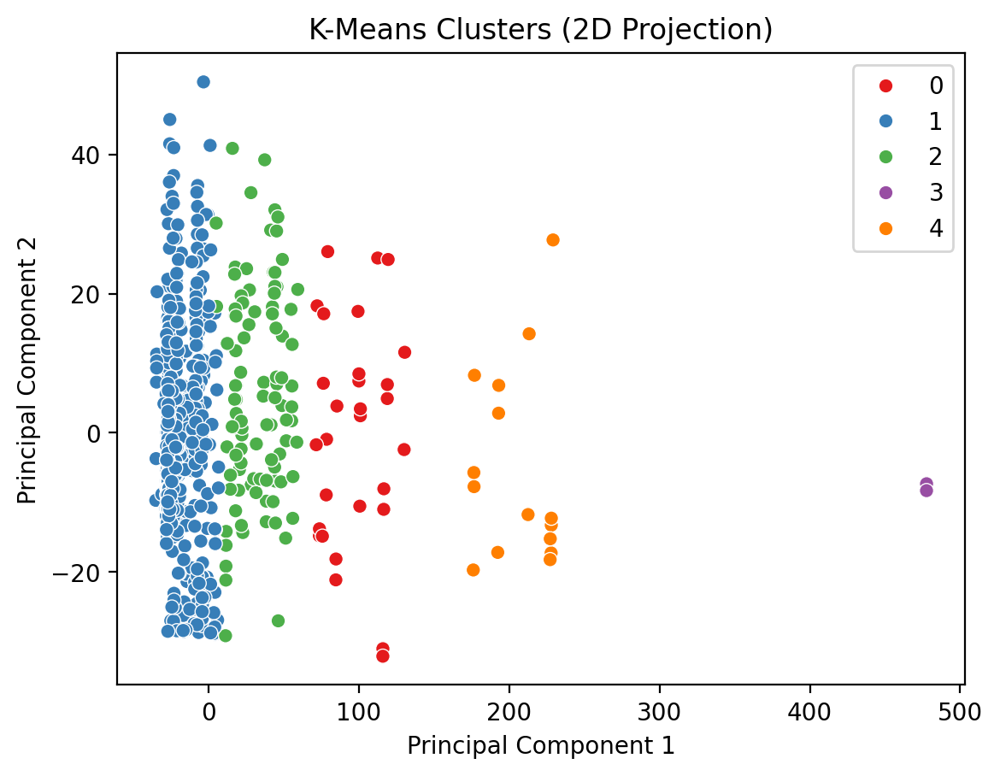
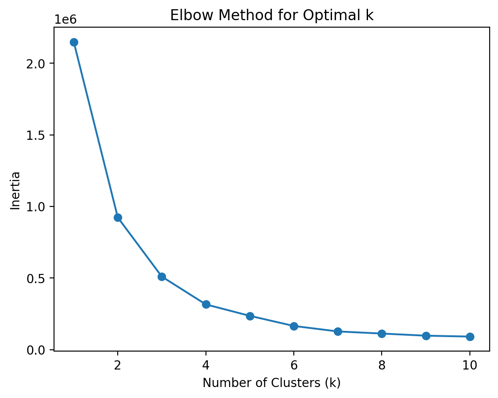
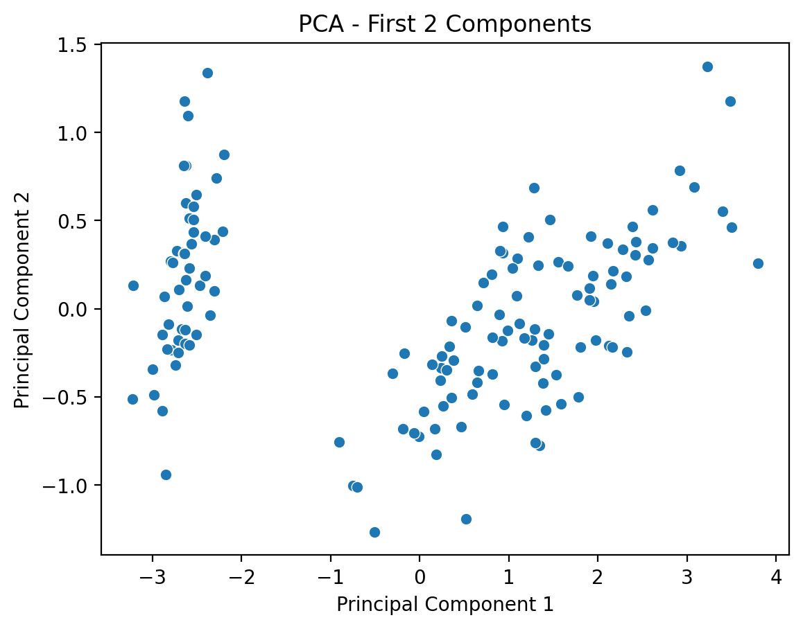
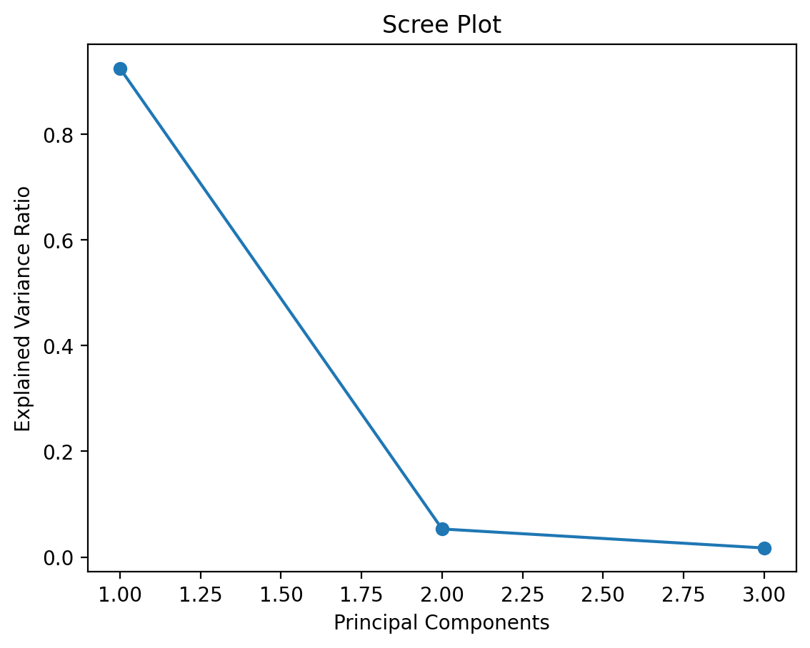

#  ⚙️ Streamlit Cloud Unsupervised Machine Learning App

## Project Overview:

Welcome! This interactive Streamlit application allows users to explore unsupervised machine learning models with built-in or custom datasets. Users can:

- Upload their own CSV data or use provided Titanic/Iris datasets

- Select feature variables

- Choose unsupervised machine learning models such as K-Means Clustering and Principal Component Analysis (PCA)

- View performance metrics and visualizations

### Run Locally

cd MLUnsupervisedApp

Create a requirements.txt file

Run 'pip install pipreqs' in terminal

### Deployed Version Link
[Launch the App Here](https://kunisaki-data-science-portfolio-unsupervised-ml-app.streamlit.app/)

### Necessary Libraries
- matplotlib 3.10.1
- pandas 2.2.3
- seaborn 0.13.2
- streamlit 1.37.1
- scikit-learn 1.5.1

## App Features:

- **Dataset Options**:
  - Built-in datasets: Titanic and Iris
  - Upload your own CSV file

- **Model Options**:
  - K-Means Clustering
  - Principal Component Analysis (PCA)

- **Interactive Hyperparameter Tuning**:
  - K-Means: Choose number of clusters (k), initialization method (k-means++ or random)
  - PCA: Select number of components (up to 10)

- **Performance Metrics**:
  - K-Means: Silhouette Score (cluster separation); Inertia (within-cluster sum of squares)
  - PCA: Explained Variance Ratio (how much variance each component explains)

- **Visualizations**:
  - PCA 2D Projection of K-Means Clusters
  - Elbow Plot (to choose optimal k)
  - Scree Plot (to decide how many PCA components to retain)
  - Data preview and feature selection summaries

## Visual Examples:

### **Titanic Dataset — K-Means Cluster Plot (PCA 2D Projection)**

This plot shows Titanic passengers projected onto two principal components (PCA), colored by K-Means cluster (k = 5).We observe five distinct clusters, mainly separated along Principal Component 1. Some clusters are tightly packed, while others sit at the extremes, suggesting outlier or unique passenger groups.

### **2. Titanic Dataset — Elbow Method Plot**

This plot shows the inertia (within-cluster sum of squares) versus the number of clusters. The clear “elbow point” at k = 4 or 5 suggests an optimal number of clusters, where adding more clusters yields diminishing returns in reducing inertia.

### **3. Iris Dataset — K-Means Cluster Plot (PCA 2D Projection)**

This visual shows the classic Iris dataset clustered and projected into 2D using PCA. It highlights natural separations among flower species, confirming K-Means’ ability to capture biological groupings.

### **4. Iris Dataset — PCA Scree Plot**

This scree plot shows the explained variance ratio of each PCA component. It helps decide how many components to keep by identifying where the curve levels off, retaining enough variance for meaningful analysis.

## References:

To see some of the resources I used, and for further reading, please reference the sources below.

- **Scikit-learn Models**
  - [K Means](https://scikit-learn.org/stable/modules/generated/sklearn.cluster.KMeans.html)
  - [PCA](https://scikit-learn.org/stable/modules/generated/sklearn.decomposition.PCA.html)
  - [Silhouette Score](https://scikit-learn.org/stable/modules/generated/sklearn.metrics.silhouette_score.html)
  - [StandardScaler](https://scikit-learn.org/stable/modules/generated/sklearn.preprocessing.StandardScaler.html)

- **Streamlit**
  - [Sidebar Layout](https://docs.streamlit.io/develop/api-reference/layout/st.sidebar)
  - [Tabs](https://docs.streamlit.io/develop/api-reference/layout/st.tabs)
  - [Markdown Text](https://docs.streamlit.io/develop/api-reference/text/st.markdown)

- **General**
  - [Scikit-learn User Guide](https://scikit-learn.org/stable/user_guide.html)
  - [Pandas Documentation](https://pandas.pydata.org/docs/)
  - [Streamlit Documentation](https://docs.streamlit.io/)
  - [Resize Image in Markdown](https://stackoverflow.com/questions/14675913/changing-image-size-in-markdown)
