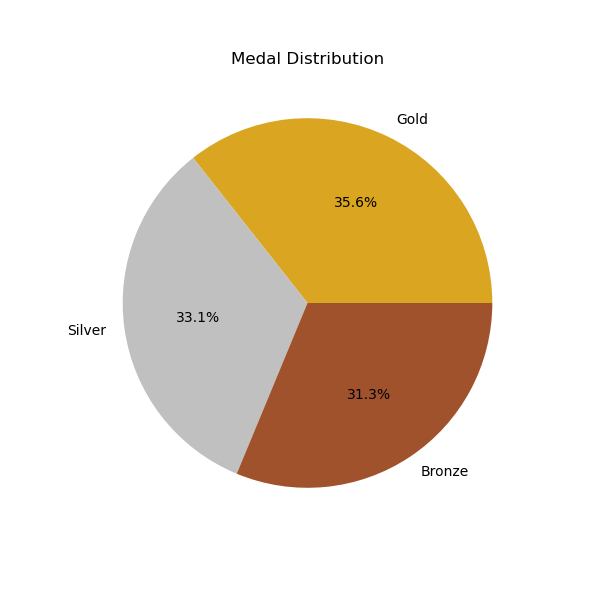

# 🏅 2008 Olympic Medalists Tidy Data

## Project Overview:

Welcome! This project focuses on cleaning and visualizing a **2008 Summer Olympic Medalists dataset** using **tidy data principles**. I transformed the dataset so that:

- Each variable has its own column
- Each observation forms its own row
- Each type of observational unit forms its own table

My objectives are to clean the data and then do basic data analysis on the data. These tidy data principles are important because they make data analysis easier by standardizing one structure across the data. This project includes analysis through **visualizations** and a **pivot table** aggregation to provide deeper insights from the cleaned data.

## Dataset Description:

### 2008 Summer Olympic Medalists Dataset:

"olympics_08_medalists.csv" adapted from [here](https://edjnet.github.io/OlympicsGoNUTS/2008/).

The dataset lists every athlete who one a medal in the 2008 Olympic Games, and their corresponding gender/sport, and medal won (gold, silver, or bronze).

Some pre-processing steps that I took were standardizing column names, reshaping data using the melt() command, splitting the combined gender-sport variable into separate columns, and finally, removing unnecessary characters (underscores) and formatting inconsistencies (capitalization).

### Run Locally

1. Open the terminal in VS Code
2. Navigate to the project folder
    - ls 
    - cd TidyData-Project/
3. Install required Python libraries (if first-time user)
    - pip install pandas matplotlib seaborn
4. Run code

### Necessary Libraries
- matplotlib 3.10.1
- pandas 2.2.3
- seaborn 0.13.2

## Project Features
- **Data Cleaning & Transformation**:
  - Apply tidy data principles for standardized structure
- **Data Analysis**:
  - Explore medal counts by sport, gender, and medal type
- **Visualizations**:
  - Barplots and countplots summarizing key trends

## Visual Examples:

### **1. Top 5 Sports by Number of Medals**

### **2. Number of Medals by Gender**

### **3. Medal Distribution**

## References:

To see some of the resources I used, and for further reading, please reference the sources below.

- **[Pandas Cheat Sheet](https://pandas.pydata.org/Pandas_Cheat_Sheet.pdf)**
- **[Tidy Data Principles](https://vita.had.co.nz/papers/tidy-data.pdf)**
- **[Seaborn Barplots](https://seaborn.pydata.org/generated/seaborn.barplot.html)**
- **[Seaborn Countplots](https://seaborn.pydata.org/generated/seaborn.countplot.html)**